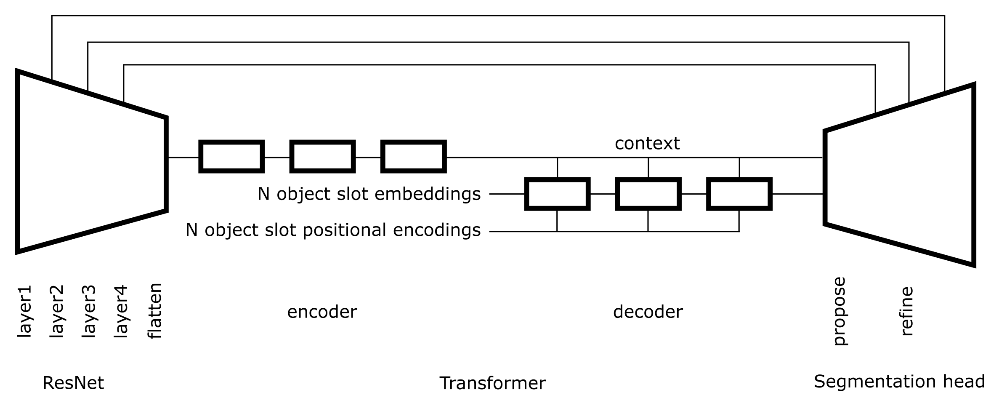
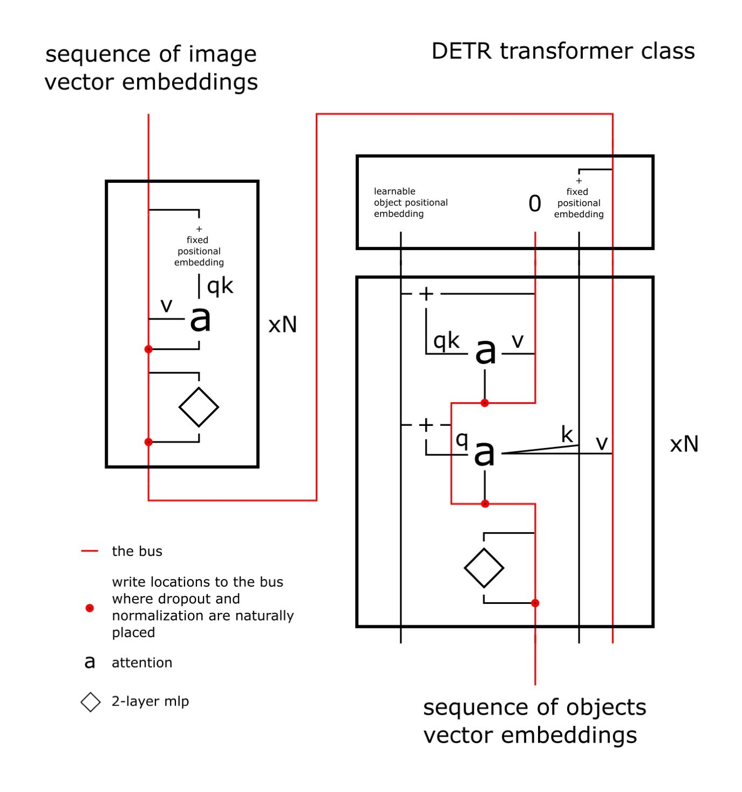

Work in progress.

# Architecture

## Highlevel

## DETR Transformer 

# Misc

## Losses comparison

intersection decrease, union increase, distance between centers increse for losses:
- intersection over union
- union over enclosure
- generalized intersection over union (https://giou.stanford.edu)
- distance + intersection over union (https://arxiv.org/abs/1911.08287)
- euclidian distance between centers over euclidian distance between top-left and bottow-right corners of the enclosure

https://raw.githubusercontent.com/protsenkovi/diydetr/master/docs/videos/intersection_dec_union_inc.mp4

intersection and union increases, distance stay fixed

https://raw.githubusercontent.com/protsenkovi/diydetr/master/docs/videos/intersection_inc_union_inc.mp4

intersection over union and dod losses

https://raw.githubusercontent.com/protsenkovi/diydetr/master/docs/videos/iou_and_dod.mp4

## predicted to target boxes assignment 

https://raw.githubusercontent.com/protsenkovi/diydetr/master/docs/videos/predicted_to_target_boxes_assignment.mp4

## example of code starting to work

training for several epochs for the fixed batch.

https://raw.githubusercontent.com/protsenkovi/diydetr/master/docs/videos/example_convergence_for_fixed_batch.mp4